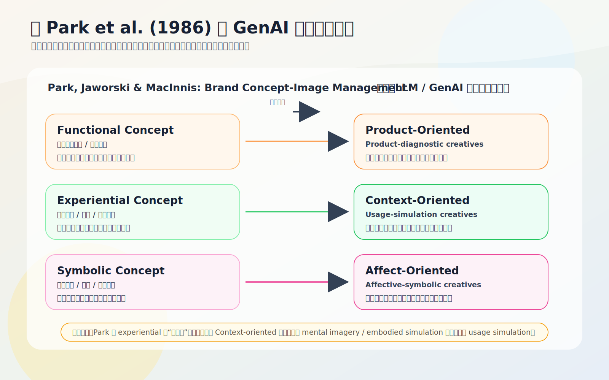
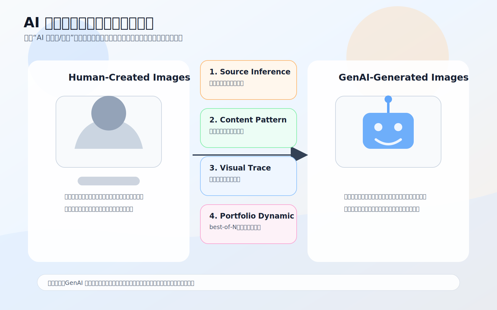
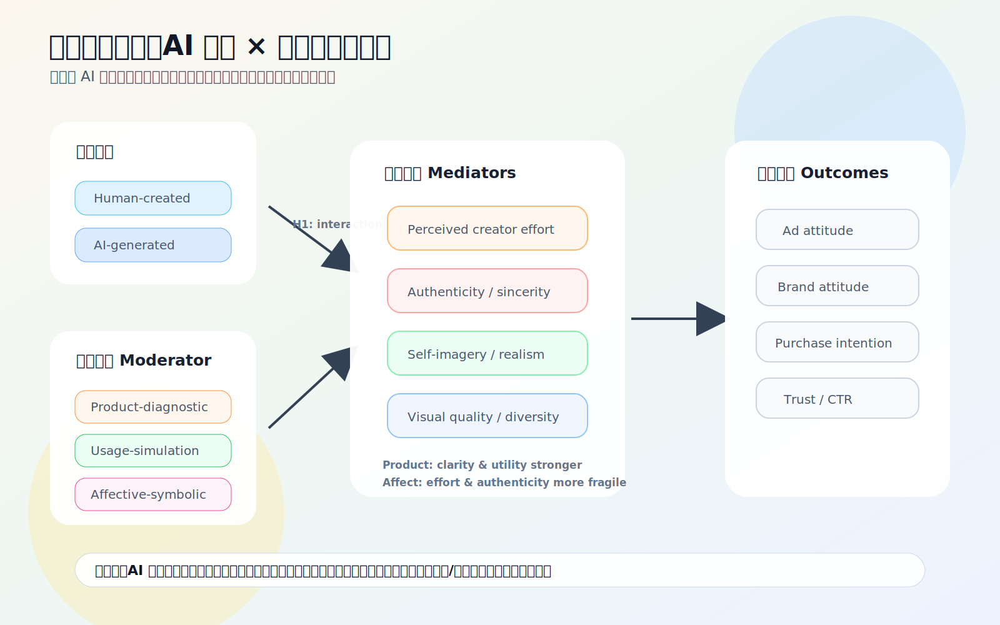
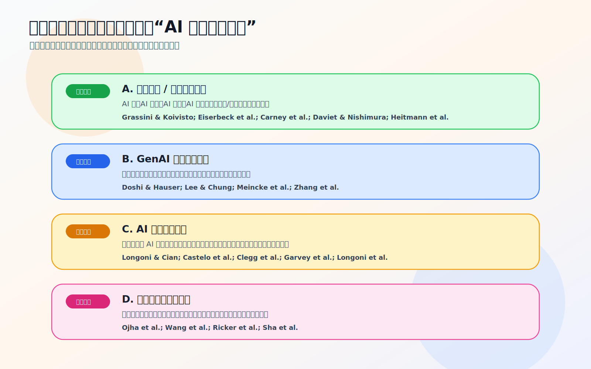

# GenAI 生成广告图理论图示索引（0516）

这组图用于把“Park 三分类理论基础 + AI 图 vs 人图差异 + 假设模型 + 文献证据分层”可视化。均为 SVG，可直接插入 Markdown、PPT 或论文草稿后再微调。

| 图 | 文件 | 用途 |
|---:|---|---|
| Fig. 1 | `Fig1_Park三分类理论桥接_0516.svg` | 展示 Park et al. (1986) 的 `functional / experiential / symbolic` 如何转译为本文的 `Product / Context / Affect` 三类广告图创意取向。 |
| Fig. 2 | `Fig2_AI图与人图差异框架_0516.svg` | 总结 AI 生成图相对人类图的四类差异：来源推断、内容结构、视觉痕迹、组合动态。 |
| Fig. 3 | `Fig3_AI来源x创意取向假设模型_0516.svg` | 展示核心假设模型：AI 来源 × 创意取向，通过 effort、authenticity、self-imagery、quality/diversity 影响广告结果。 |
| Fig. 4 | `Fig4_文献证据分层图_0516.svg` | 将文献分为直接图像证据、创意内容证据、机制证据、技术证据，说明主文应优先引用哪些。 |

## 预览

